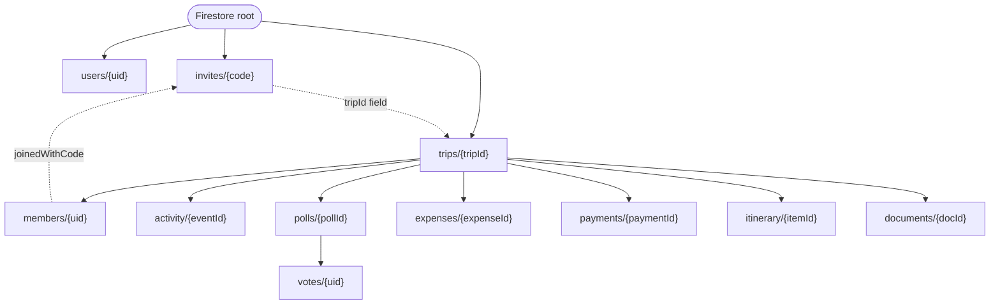

# HamweTrip — Data Model

Entity relationships for the HamweTrip Firestore database.

## Reading this as a document database

Firestore is not relational, so three things differ from a textbook ERD:

- **No foreign key enforcement.** Every relationship drawn below is a `uid` or
  `tripId` string stored in a document. Nothing at the database level stops it
  pointing at something deleted — the security rules and the repository layer
  enforce integrity instead.
- **Ownership is a path, not a join.** Most entities live in a subcollection
  beneath their trip, so `tripId` is implied by where the document sits rather
  than stored inside it. Only the two top-level collections (`users`,
  `invites`) carry it explicitly.
- **Some fields are deliberately duplicated.** `displayName` appears on both
  `users` and `trip_members`. That is a denormalization, not an error — see
  [Design decisions](#design-decisions).

**Status:** `users`, `trips`, `trip_members`, `invites` and `activity_events`
are implemented and deployed. `polls`, `votes`, `expenses`, `payments`,
`itinerary_items` and `documents` are designed but not yet built — their
security rules are still deny-all placeholders.

**Exported images** for reports and slides, where Mermaid does not render:
[`erd-entities.png`](erd-entities.png) · [`erd-hierarchy.png`](erd-hierarchy.png)
(SVG versions alongside them). Regenerate after editing this file with:

```bash
npx -y @mermaid-js/mermaid-cli -i docs/ERD.md -o docs/erd.png -w 2400 -b white
```

---

## Entity relationship diagram

```mermaid
erDiagram
    USERS ||--o{ TRIP_MEMBERS : "joins trips as"
    USERS ||--o{ INVITES : creates
    USERS ||--o{ ACTIVITY_EVENTS : "is actor of"
    USERS ||--o{ VOTES : casts
    USERS ||--o{ EXPENSES : "paid for"
    USERS ||--o{ PAYMENTS : sends
    USERS ||--o{ DOCUMENTS : uploads

    TRIPS ||--|{ TRIP_MEMBERS : has
    TRIPS ||--o{ INVITES : "is joined by"
    TRIPS ||--o{ ACTIVITY_EVENTS : records
    TRIPS ||--o{ POLLS : hosts
    TRIPS ||--o{ EXPENSES : tracks
    TRIPS ||--o{ PAYMENTS : settles
    TRIPS ||--o{ ITINERARY_ITEMS : schedules
    TRIPS ||--o{ DOCUMENTS : keeps

    POLLS ||--o{ VOTES : collects
    INVITES ||--o{ TRIP_MEMBERS : "admitted"

    USERS {
        string uid PK "Firebase Auth uid"
        string displayName
        string email
        string phone "nullable, MoMo number"
        string photoUrl "nullable"
        timestamp createdAt "server"
        bool notificationsEnabled
    }

    TRIPS {
        string tripId PK
        string name
        string destination
        string ownerId FK "creator uid"
        string currency "RWF"
        string status "planning active completed archived"
        timestamp startDate "nullable UTC"
        timestamp endDate "nullable UTC"
        timestamp createdAt "server"
        timestamp updatedAt "server"
    }

    TRIP_MEMBERS {
        string uid PK "also the document id"
        string tripId PK "implied by path"
        string role "organizer editor member"
        string displayName "denormalized from users"
        string photoUrl "denormalized nullable"
        int balanceMinor "nullable net position"
        string joinedWithCode FK "nullable invite code"
        timestamp joinedAt "server"
    }

    INVITES {
        string code PK "the document id"
        string tripId FK "stored not implied"
        string createdBy FK "organizer uid"
        int maxUses "-1 means unlimited"
        int usedCount
        bool revoked
        timestamp createdAt "server"
        timestamp expiresAt "nullable"
    }

    ACTIVITY_EVENTS {
        string eventId PK
        string tripId FK "implied by path"
        string type "trip_created member_joined vote_cast etc"
        string actorId FK "uid who caused it"
        string actorName "denormalized nullable"
        string summary "server authored sentence"
        string entityId "nullable target of deep link"
        timestamp createdAt "server"
    }

    POLLS {
        string pollId PK
        string tripId FK "implied by path"
        string question
        array options "embedded id label voteCount"
        string status "open closed"
        string createdBy FK
        timestamp closesAt "nullable"
        timestamp createdAt "server"
    }

    VOTES {
        string uid PK "also the document id"
        string pollId PK "implied by path"
        string optionId FK "into the embedded options"
        timestamp votedAt "server"
    }

    EXPENSES {
        string expenseId PK
        string tripId FK "implied by path"
        string title
        int amountMinor "never floating point"
        string paidByUid FK
        array splitUserIds "uids sharing the cost"
        string category
        string status
        timestamp createdAt "server"
    }

    PAYMENTS {
        string paymentId PK
        string tripId FK "implied by path"
        string fromUid FK "debtor"
        string toUid FK "creditor"
        int amountMinor
        string momoRef "reference the payer quotes"
        string status "owed claimed_paid confirmed rejected"
        string requestId "idempotency key"
        string confirmedBy FK "nullable"
        timestamp createdAt "server"
    }

    ITINERARY_ITEMS {
        string itemId PK
        string tripId FK "implied by path"
        string title
        string location
        string notes
        int order "sparse gaps of 1000"
        string createdBy FK
        timestamp startAt "UTC"
    }

    DOCUMENTS {
        string docId PK
        string tripId FK "implied by path"
        string name
        string url "external link not a stored file"
        string type
        string category
        string uploadedBy FK
        timestamp createdAt "server"
    }
```



---

## Document hierarchy

The same model as Firestore actually stores it. Nesting is what makes the
security rules expressible: a rule at `trips/{tripId}/...` can check membership
from the path alone.



Solid arrows are subcollections. Dotted arrows are references by stored field.

---

## Design decisions

Four choices the diagram alone does not explain.

### Invites are top-level, not nested under the trip

Every other trip-owned entity sits under `trips/{tripId}`. Invites cannot:
`joinTrip(code)` is called by someone who is **not yet a member and does not
know the trip id**, so a path like `trips/{tripId}/invites/{code}` cannot be
resolved without the very id the code is meant to reveal.

The code is the **document id**, which makes uniqueness a property of the
database rather than a read-then-write that races when two organizers generate
a code at the same moment. The security rule allows `get` by exact code but
forbids unrestricted `list`, or the collection would become an enumerable
directory of every trip in the system.

### Membership is stored once, with no array on the trip

An earlier revision denormalized a `memberIds` array onto `trips` so
"which trips am I in?" could be one `arrayContains` query. That does not survive
without Cloud Functions: redeeming an invite would require a non-member to
update the trip document, and no rule can safely permit that.

Membership now lives only in `trips/{tripId}/members/{uid}`, and the query runs
as `collectionGroup('members').where('uid', isEqualTo: me)`. The `uid` is
duplicated into the document body because a collection group query can filter on
fields but never on document ids.

### displayName and photoUrl are duplicated onto members

`users/{uid}` is **owner-read-only** — nobody can read another person's profile,
even a trip-mate. That keeps emails and phone numbers unreachable. The trade is
that a member list has to carry its own copy of each person's name and photo, so
a roster renders in one read instead of N and without exposing the profile.

The copies are refreshed by the client on profile edit. They are display-only;
`users/{uid}` remains the source of truth.

### Money is always an integer, and documents are links

`amountMinor` and `balanceMinor` are integer **minor units**. RWF has no minor
unit, so a stored `5000` means RWF 5,000 — not RWF 50.00. Floating point never
touches a stored amount.

`documents.url` holds an external link rather than a file, because Cloud Storage
is not available on this project's Firebase plan. The vault is a registry of
where documents live, not a store of the documents themselves.

---

## Constraints the schema cannot express

Enforced in security rules or the repository layer, not by the data model:

| Constraint | Enforced by |
|---|---|
| One membership per person per trip | Document id is the uid |
| One vote per member per poll | Document id is the uid |
| An invite cannot be redeemed past `maxUses` | Rule + client transaction |
| A member cannot promote themselves | Security rule |
| Activity is append-only | Security rule, no update or delete |
| A trip always keeps at least one organizer | Repository — rules cannot count sibling documents |
| A custom split must sum to the expense total | `splitCustom` in `domain/money.dart` |
